## Information

Name: Nguyễn Xuân Long

ID: 20075751

Subject: Kiến trúc và Thiết kế phần mềm

#### Description

Create a simple Spring Boot application with ActiveMQ and JMS, simulating the product purchasing process

## Installation

- Create simple Spring Boot project with monolithic architecture
  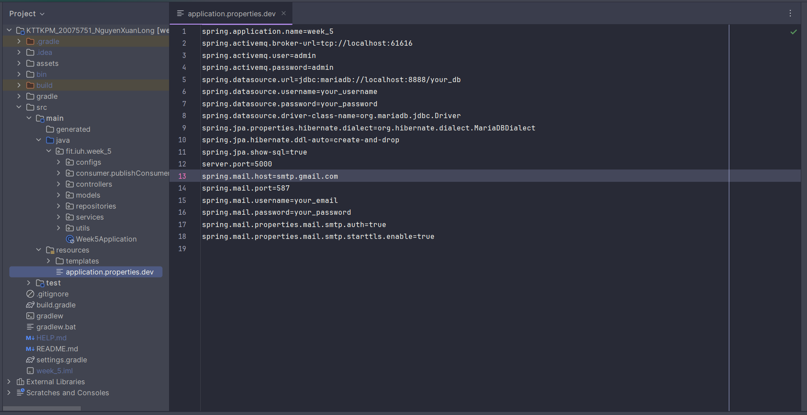
- Run database(mariadb)(you can run with Xampp or docker)
  - docker(use [HeidiSQL](https://www.heidisql.com/download.php) to connect to mariadb)
  ```bash
  docker run --name some-mariadb -p 8888:3306 -e MARIADB_ROOT_PASSWORD=yourpassword -d mariadb
  ```
  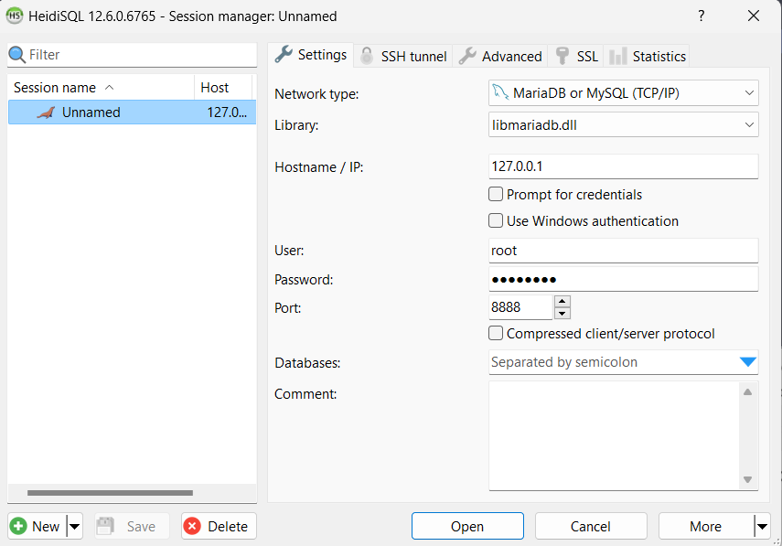
  - Xampp:[Install](https://sourceforge.net/projects/xampp/) and run mariadb
    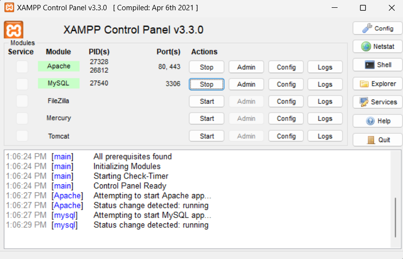
- [Install ActiveMQ](https://activemq.apache.org/components/classic/download/) and run in your local path

  ```bash
  C:\apache-activemq-6.1.0\bin\win64\activemq.bat
  ```

  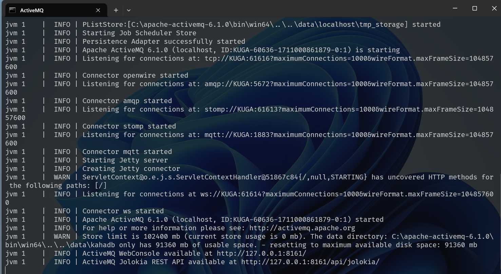
  [ActiveMQ UI running](http://localhost:8161/admin)
  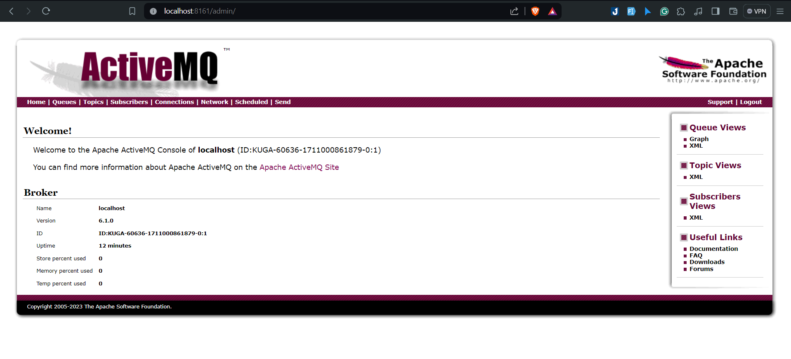

## Usage

- Screen product(add new product and show product)
  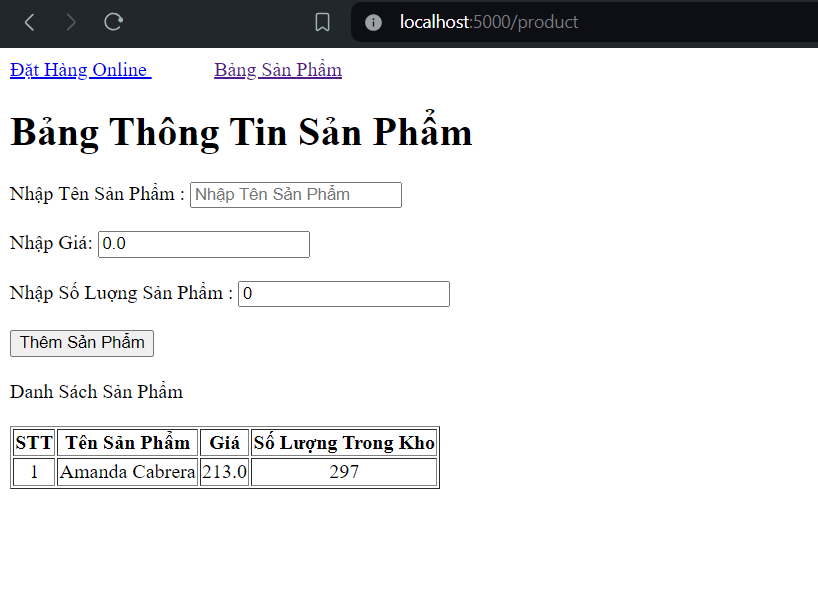
- Screen purchase(order and show ordered)
  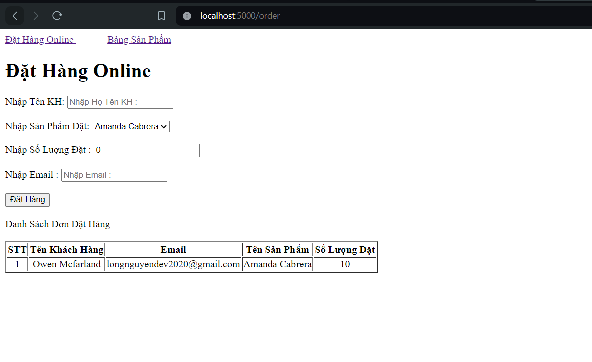

When you add a new order, it will be sent to ActiveMQ and the consumer will receive the message, send Email to customer and save it to the database
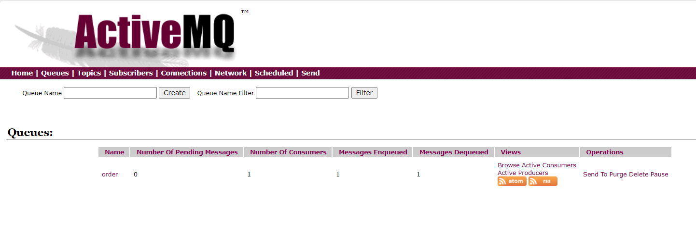

Payload send to ActiveMQ:
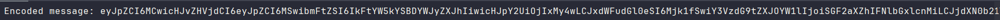
Result of payload([Use base64](https://www.convertstring.com/vi/EncodeDecode/Base64Decode))
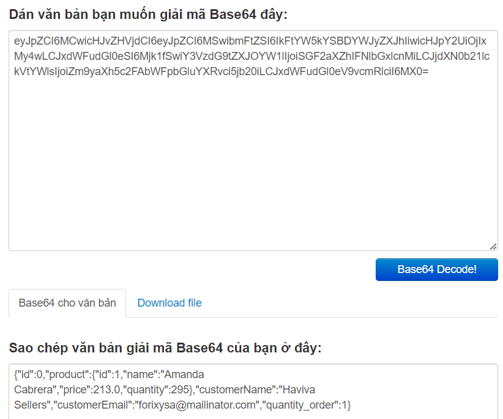
Email customer have received when order success:
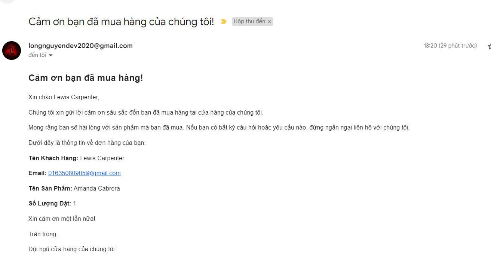
Or when order fail:
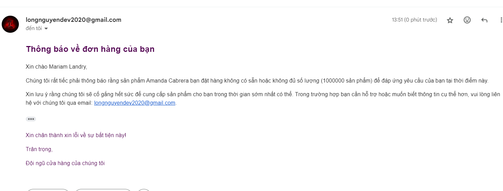

If you dont listen JMS event, the active will keep the message and push to pending message
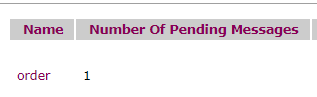

```java
  //  @JmsListener(destination = "order")
  public void receiveMessage(final Message jsonMessage) throws JMSException {
    if (jsonMessage instanceof TextMessage textMessage) {
      String jsonListOfProduct = textMessage.getText();
      processMessage(jsonListOfProduct);
    }
  }
```

## Configuration third-party

- Setup password when you send email

  Step 1: Go to [Google Account](https://myaccount.google.com/)

  Step 2: Select Security in the left pane
  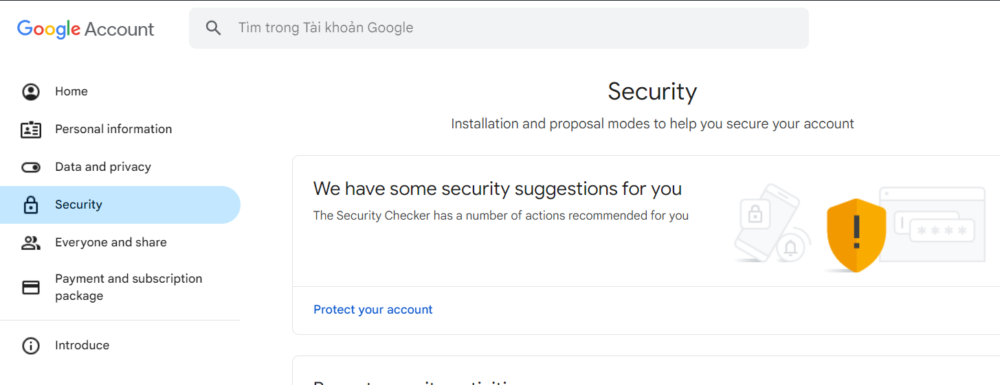

  Step 3: Find Verify your identity and select 2-Step Verification

  Step 4: Scroll down and select App passwords

  Step 5: Create new app password and copy your password to application.properties
  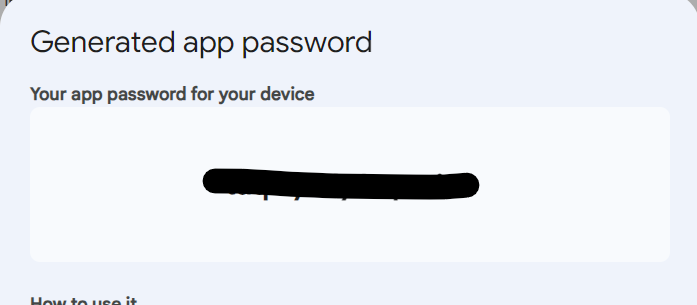

# Thank you for visiting my project :heart:
