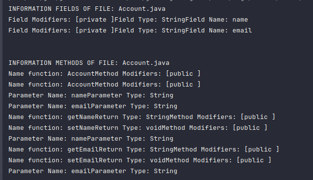
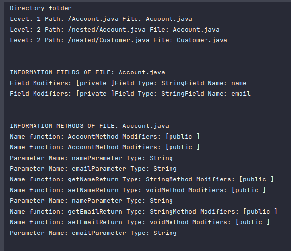
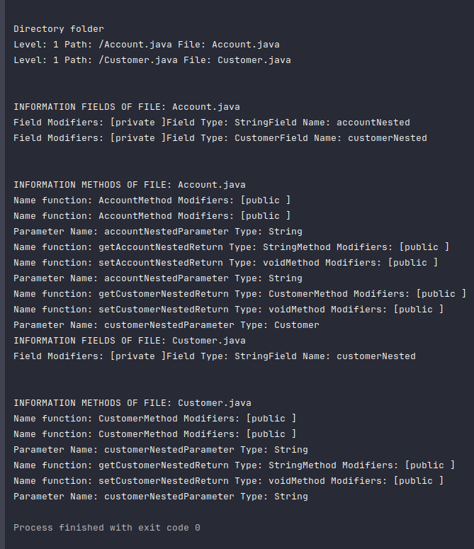
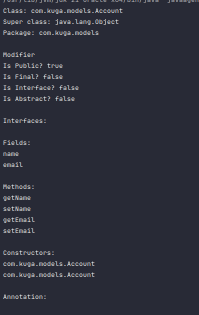

## Information

Name: Nguyễn Xuân Long

ID: 20075751

Subject: Kiến trúc và Thiết kế phần mềm

#### Description

Week 2 exercises: Write a tool that allows testing the entire project

### 1.Exercises 1: Read a java source file, extract(fields, methods(include parametters))

### 2. Exercises 2:Give a folder, scan all java files(include nested folder) perform actions in exercises 1

### 3. Exercises 3: Use java reflection to read the structure of any class(built javafile) file

## 4. Tools

- [IntelliJ IDEA](https://www.jetbrains.com/idea/)
  

# Cảm ơn thầy đã ghé thăm dự án của em :heart:
