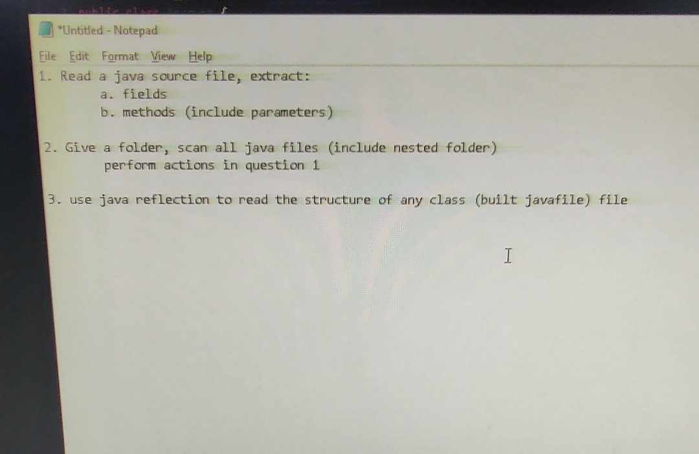

## Information

Name: Nguyễn Xuân Long

ID: 20075751

Subject: Kiến trúc và Thiết kế phần mềm

#### Description

Week 2 exercise: Write a tool that allows testing the entire project


### 1.Exercise 1: Read a java source file, extract(fields, methods(include parametters))


### 2. Exercise 2:Give a folder, scan all java files(include nested folder) perform actions in exercise 1


### 3. Exercise 3: Use java reflection to read the structure of any class(built javafile) file


## 4. Tools

- [IntelliJ IDEA](https://www.jetbrains.com/idea/)
  

## 5.Library

- [Java Parser](https://javaparser.org/)

```
<dependency>
    <groupId>com.github.javaparser</groupId>
    <artifactId>javaparser-core</artifactId>
    <version>3.25.8</version>
</dependency>

```

# Cảm ơn thầy đã ghé thăm dự án của em :heart:
