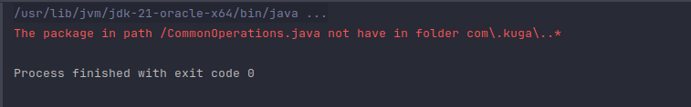
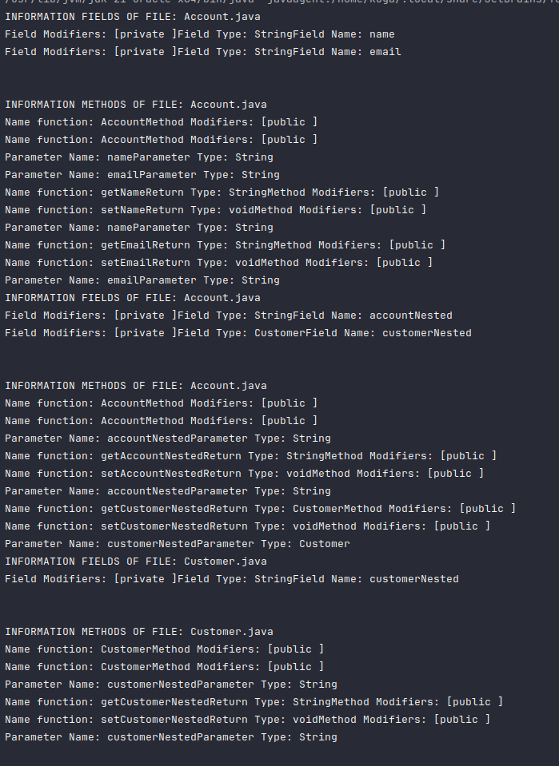
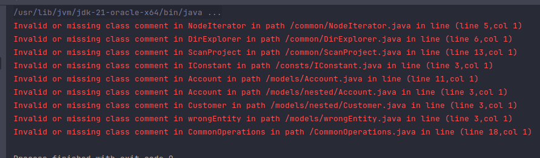
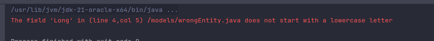
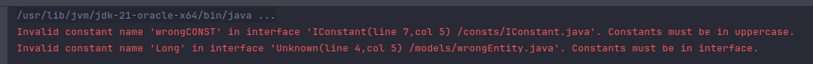
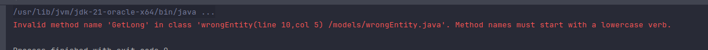
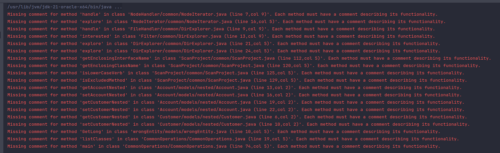

## Information

Name: Nguyễn Xuân Long

ID: 20075751

Subject: Kiến trúc và Thiết kế phần mềm

#### Description

Week 3 exercises: Write a tool that allows testing the entire project

### 1.Các package trong dự án phải theo mẫu: com.companyname.~ (~:tên bất kỳ)



### 2. Các class phải có tên là một danh từ hoặc cụm danh ngữ và phải bắt đầu bằng chữ hoa.

Thiếu trường hợp class phải có tên là một danh từ hoặc cụm danh ngữ



### 3. Mỗi lớp phải có một comment mô tả cho lớp. Trong comment đó phải có ngày tạo (created-date) và author.



## 4. Các fields trong các class phải là danh từ hoặc cụm danh ngữ và phải bắt đầu bằng một chữ thường.

Thiếu trường hợp fields phải là danh từ hoặc cụm danh ngữ


## 5. Tất cả các hằng số phải là chữ viết hoa và phải nằm trong một interface.



## 6. Tên method phải bắt đầu bằng một động từ và phải là chữ thường

Thiếu trường hợp method phải bắt đầu bằng một động từ


## 7. Mỗi method phải có một ghi chú mô tả cho công việc của method trừ phương thức default constructor, accessors/mutators, hashCode, equals, toString.

Thiếu trường hợp default constructor, accessors/mutators


## 8. Tools

- [IntelliJ IDEA](https://www.jetbrains.com/idea/)
  

## 9.Library

- [Java Parser](https://javaparser.org/)

```
<dependency>
    <groupId>com.github.javaparser</groupId>
    <artifactId>javaparser-core</artifactId>
    <version>3.25.8</version>
</dependency>

```

- [Google guava](https://github.com/google/guava)

```
<!-- https://mvnrepository.com/artifact/com.google.guava/guava -->
<dependency>
    <groupId>com.google.guava</groupId>
    <artifactId>guava</artifactId>
    <version>32.1.3-jre</version>
</dependency>
```

# Cảm ơn thầy đã ghé thăm dự án của em :heart:
