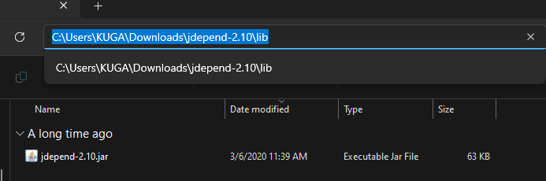
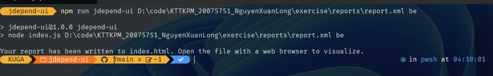
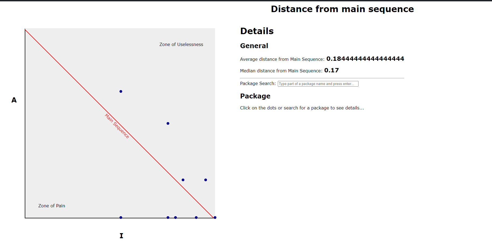

## Information

Name: Nguyễn Xuân Long

ID: 20075751

Subject: Kiến trúc và Thiết kế phần mềm

#### Description

Visualizing distance from the main sequence and other Clean Architecture metrics in Java

## Step to run

- Step 1: Download jdepend-2.1.0.jar and put to folder libs of java project(exercise project)
  [Download jdepend-2.1.0.jar](https://github.com/clarkware/jdepend/tree/master/dist)
  Note: The library will be in this path
  
- Step 2: Implement jdepend-2.1.0.jar to build.gradle file

```java
implementation fileTree(dir: 'libs', include: ['*.jar'])
```

- Step 3: Write code for export the report of project to xml

```java
package org.example;

import jdepend.xmlui.JDepend;

import java.io.PrintWriter;

public class Main {
    public static void main(String[] args) throws Exception{
        JDepend jdepend = new JDepend(new PrintWriter("reports/report.xml"));
        jdepend.addDirectory("D:\\code\\KTTKPM_20075751_NguyenXuanLong\\Library-Assistant");
        jdepend.analyze();
        System.out.println("Analysis completed");
    }
}
```

- Step 4: Clone JDepend-UI and install library

```bash
git clone https://github.com/ValentinaServile/jdepend-ui.git
cd jdepend-ui
npm install
```

- Step 5: Run JDepend-UI and this file will be in folder jdepend-ui with name index.html

```bash
npm run jdepend-ui <your-path-to-xml-report> be
ex: npm run jdepend-ui D:\code\KTTKPM_20075751_NguyenXuanLong\Library-Assistant\reports\report.xml be
```



- Step 6: Open index.html file in browser and see the result
  

# Cảm ơn thầy đã ghé thăm dự án của em :heart:
