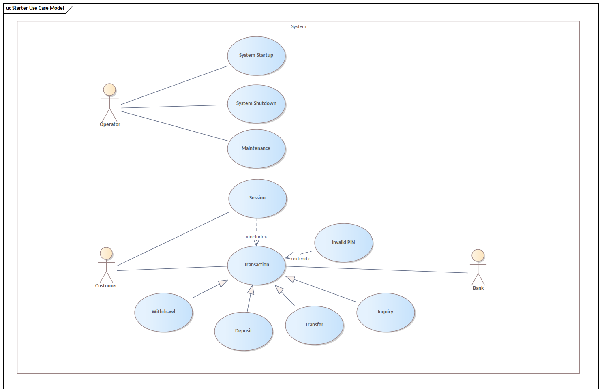
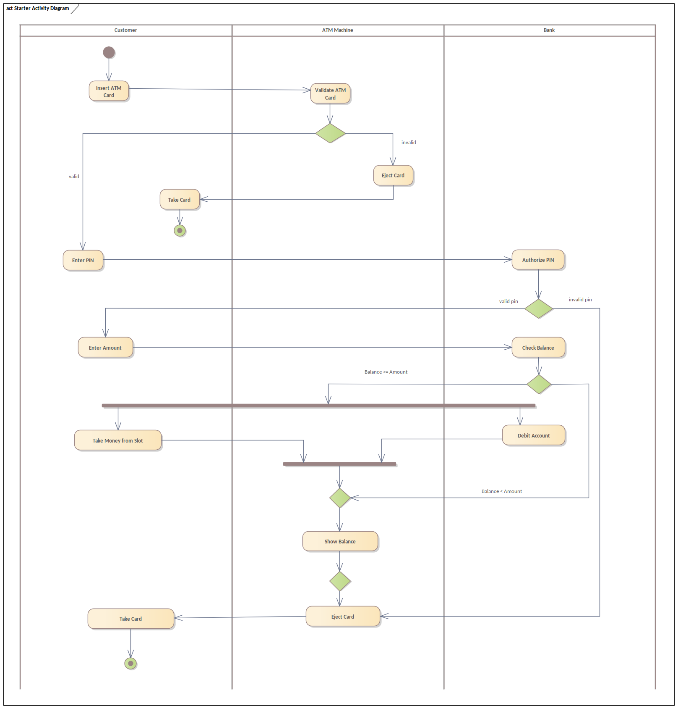
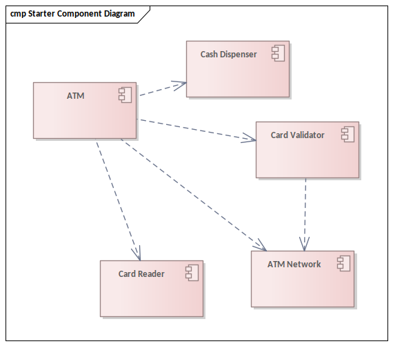
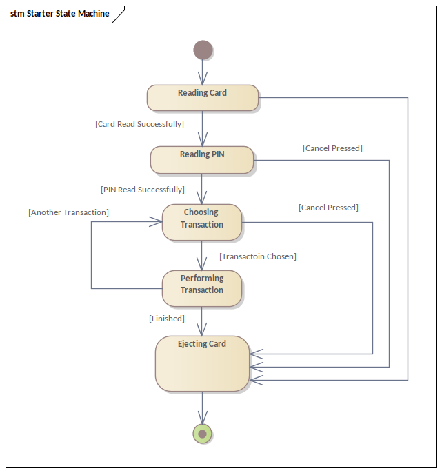
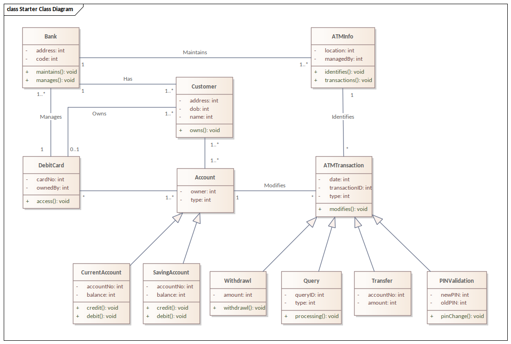

## Information

Name: Nguyễn Xuân Long
ID: 20075751
Subject: Kiến trúc và Thiết kế phần mềm

#### Description

Week 1 exercises: UML diagram for ATM application

### 1.Usecase diagram

### 2. Actitivy diagram

### 3. Sequence diagram

### 4. Component diagram

### 5 Statechart diagram

### 6. Class diagram

## 6. Tools

- [Enterprise Architect](https://sparxsystems.com/)
  

# Cảm ơn thầy đã ghé thăm dự án của em :heart:
